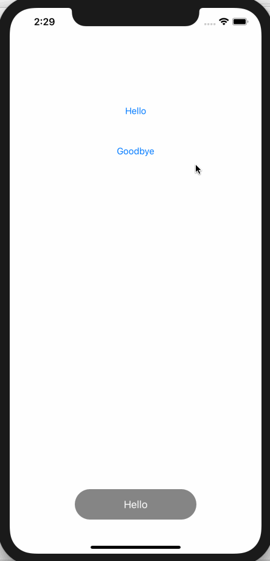

MKAToastView
===

***MKAToastView is the view that disappears automatically after displaying a short message for a few seconds like Android's Toast.***



## Include in your iOS app

### CocoaPods

MKAToastView is available through [CocoaPods](http://cocoapods.org). To install
it, simply add the following line to your Podfile:

```ruby
pod "MKAToastView"
```

### Manual Installation

1. Download latest [MKAToastView](https://github.com/HituziANDO/MKAToastView/releases)
1. Drag & Drop MKAToastView.framework into your Xcode project

## Usage

1. Import the module
	
	**Objective-C**
	
	```objc
	#import <MKAToastView/MKAToastView.h>
	```

	**Swift**
	
	```swift
	import MKAToastView
	```

1. Create and show a short message
	
	**Objective-C**
	
	```objc
	[MKAToast showText:"@Hello" withTimeInterval:MKAToastShortTime];
	```
	
	**Swift**
	
	```swift
	MKAToast.showText("Hello", withTimeInterval: MKAToastShortTime)
	```
	
### Delegate

The toast view calls the delegate methods when it is hidden.
 
**Objective-C**

```objc
@interface ViewController () <MKAToastDelegate>

@end

@implementation ViewController

...

- (IBAction)helloButtonPressed:(id)sender {
    [MKAToast showText:@"Hello"
          withDelegate:self
          timeInterval:MKAToastShortTime
            identifier:1];
}

...

#pragma mark - MKAToastDelegate

- (void)toastWillDisappear:(MKAToast *)toast {
    NSLog(@"Toast ID: %ld will disappear", (long) toast.identifier);
}

- (void)toastDidDisappear:(MKAToast *)toast {
    NSLog(@"Toast ID: %ld did disappear", (long) toast.identifier);
}

@end
```

**Swift**

```swift
class ViewController: UIViewController, MKAToastDelegate {
    
    ...
    
    @IBAction func helloButtonPressed(_ sender: Any) {
        MKAToast.showText("Hello",
                          with: self,
                          timeInterval: MKAToastShortTime,
                          identifier: 1)
    }
    
    ...
    
    /// MARK: - MKAToastDelegate
    
    func toastWillDisappear(_ toast: MKAToast) {
        print("Toast ID: \(toast.identifier) will disappear");
    }
    
    func toastDidDisappear(_ toast: MKAToast) {
        print("Toast ID: \(toast.identifier) did disappear");
    }
}
```

More info, see my [sample project](https://github.com/HituziANDO/MKAToastView/tree/master/Sample).
